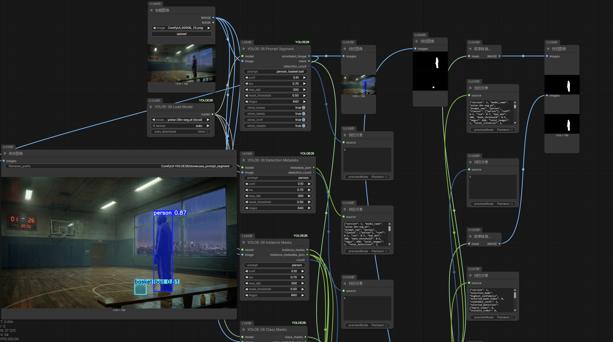

# ComfyUI-YOLOE26

[English](README.md) | [简体中文](README.zh-CN.md)

基于 Ultralytics YOLOE-26 的 ComfyUI 开放词汇提示分割节点。

## 功能

- 加载 YOLOE-26 模型，在流程中重复使用
- 使用文本提示分割物体，如 `person`、`car`、`red apple`
- 获取合并遮罩、独立实例遮罩或按类别合并的遮罩
- 结构化 JSON 元数据，便于下游自动化
- 无需重新检测即可精修遮罩
- 从多个检测结果中选择最佳实例

## 安装

### 通过 ComfyUI Manager（推荐）

在 ComfyUI Manager 中搜索 `YOLOE-26` 并点击安装。

### 手动安装

将此仓库克隆到 ComfyUI 的 `custom_nodes` 目录：

```bash
cd ComfyUI/custom_nodes
git clone https://github.com/peter119lee/ComfyUI-YOLOE26.git
pip install -r ComfyUI-YOLOE26/requirements.txt
```

重启 ComfyUI，在节点菜单中查找 `YOLOE-26` 节点。

## 快速开始

1. 添加 `YOLOE-26 Load Model` 节点并选择模型
2. 添加 `YOLOE-26 Prompt Segment` 节点
3. 连接图片并输入提示词，如 `person`
4. 运行流程

首次使用时模型会自动下载。推荐首次测试设置：

| 参数 | 值 |
|------|-----|
| `model_name` | `yoloe-26s-seg.pt` |
| `device` | `auto` |
| `prompt` | `person` |
| `conf` | `0.1` |
| `iou` | `0.7` |

## 节点说明

### YOLOE-26 Load Model

加载并验证 YOLOE-26 模型。

**输入：**
- `model_name` — 模型文件名（下拉菜单显示可用选项）
- `device` — `auto`、`cpu`、`cuda`、`cuda:N` 或 `mps`
- `auto_download` — 自动下载缺失的模型（默认：true）

**输出：**
- `model` — YOLOE_MODEL，供其他节点使用

### YOLOE-26 Prompt Segment

运行提示分割并获取带标注的预览图。

**输入：**
- `model` — 来自 Load Model 的 YOLOE_MODEL
- `image` — 输入图片
- `prompt` — 逗号分隔的类别名（如 `person, car, dog`）

**可选：**
- `conf` — 置信度阈值（默认：0.1）
- `iou` — IoU 阈值（默认：0.7）
- `max_det` — 最大检测数（默认：300）
- `mask_threshold` — 遮罩二值化阈值（默认：0.5）
- `imgsz` — 推理尺寸（默认：640）

**输出：**
- `annotated_image` — 带标注的预览图
- `mask` — 合并的二值遮罩
- `detection_count` — 检测数量

### YOLOE-26 Instance Masks

获取每个检测实例的独立遮罩。

**输出：**
- `instance_masks` — MASK 批次，每个实例一个遮罩
- `instance_metadata_json` — 包含检测详情的 JSON
- `count` — 实例数量

### YOLOE-26 Class Masks

获取每个提示类别的合并遮罩。

**输出：**
- `class_masks` — MASK 批次，每个类别一个遮罩
- `class_metadata_json` — 类别到遮罩映射的 JSON
- `output_mask_count` — 类别遮罩数量

### YOLOE-26 Detection Metadata

获取结构化检测数据，不生成图片。

**输出：**
- `metadata_json` — 包含边界框、分数、遮罩面积和类别名的 JSON
- `detection_count` — 检测数量

### YOLOE-26 Refine Mask

后处理遮罩，无需重新检测。

**方法：**
- `threshold` — 二值阈值化
- `open` — 形态学开运算
- `close` — 形态学闭运算
- `dilate` — 扩张遮罩
- `erode` — 收缩遮罩
- `largest_component` — 仅保留最大连通分量
- `fill_holes` — 填充遮罩中的孔洞

### YOLOE-26 Select Best Instance

从实例输出中选择单个最佳遮罩。

**选择模式：**
- `highest_confidence` — 最高检测置信度
- `largest_area` — 最大遮罩面积
- `confidence_then_area` — 先看置信度，面积作为决胜条件

## 模型位置

将 `.pt` 文件放在以下目录之一：

- `ComfyUI/models/ultralytics/segm/`
- `ComfyUI/models/ultralytics/bbox/`
- `ComfyUI/models/ultralytics/`
- `ComfyUI/models/yoloe/`

自动下载支持：`yoloe-26n-seg.pt`、`yoloe-26s-seg.pt`、`yoloe-26m-seg.pt`、`yoloe-26l-seg.pt`、`yoloe-26x-seg.pt`

## 示例流程



查看 `examples/` 目录中的流程 JSON 文件：

| 文件 | 说明 |
|------|------|
| `basic_api_workflow.json` | 最小快速入门流程 |
| `all_nodes_showcase_api.json` | 展示全部 7 个节点 |
| `practical_prompt_segment_api.json` | 基础分割用于重绘 |
| `practical_best_instance_api.json` | 最佳实例选择 |
| `practical_class_masks_api.json` | 按类别路由遮罩 |
| `practical_refine_mask_api.json` | 遮罩后处理 |

## 提示格式

使用逗号分隔类别名称：

```
person
person, car, dog
red apple, green bottle
```

## 环境要求

- ComfyUI
- Python 3.10+
- PyTorch
- ultralytics >= 8.3.200

## 测试环境

- ComfyUI 0.18.1
- Python 3.12.7
- PyTorch 2.7.1+cu118
- ultralytics 8.3.207

## 常见问题

**模型无法加载？**
- 检查 `.pt` 文件是否在支持的模型目录中
- 如使用 `auto_download`，请确认网络连接正常

**推理失败？**
- 如果显存不足，尝试降低 `imgsz`
- 确保你的 ultralytics 版本支持 `from ultralytics import YOLOE`

**没有检测结果？**
- 降低 `conf` 阈值
- 检查提示词是否与图片中的物体匹配

## 许可证

本仓库原创代码和文档采用 MIT 许可证。

Ultralytics 和 YOLOE 模型权重是独立的第三方依赖，有各自独立的许可证。

## 致谢

本项目参考了 [spawner1145](https://github.com/spawner1145) 的 `prompt_segment.py` 实现思路，已获授权使用。
